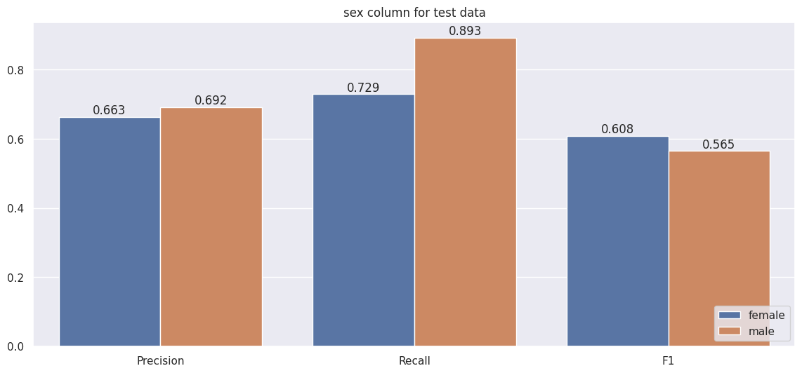
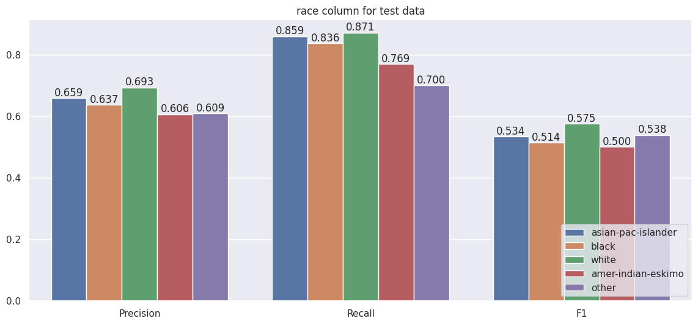

# Model Card

  
## Model Details
- This classifier trained to predict whether an employer's  income exceeds $50K/year.
- **Random Forest** and **Logistic Regression**, only **Random Forest** will be considered for evaluation since it shows better results.
- Developed by me for the third project for Udacity's Machine Learning DevOps nanodegree, October 2021.

## Intended Use
- Intended to be used to determine what features impacts the income of a person.
- Intended to determine underprivileged employers.
- Not suitable for modern dates since the data is quite old.
  
## Factors
 - Evaluate on features that may be underprivileged such as gender, race, etc.
 
## Training Data
- Census Income [Dataset](https://archive.ics.uci.edu/ml/datasets/census+income)  from UCI
 
## Evaluation Data
- Splitting the train data using `sklearn.train_test_split` with a fixed `random_state=17` and stratified on `salary label`.
  
## Metrics
- Evaluation metrics includes **Precision**, **Recall** and **F1 score**.
- These 3 metrics can be calculated from the confusion matrix for binary classification which are more suitable for imbalanced problems.

## Ethical Considerations
- Data is open sourced on UCI machine learning repository for educational purposes.

## Caveats and Recommendations
- The data was collected in 1996 which does not reflect insights from the modern world.
- Features with minor categories should be focused more when collecting extra data.

## Quantitative Analyses
|				|Train |Test   |
|---------------|------|-------|
|Precision		|0.715 |0.688  |
|Recall         |0.903 |0.868  |
|F1          	|0.592 |0.570  |

